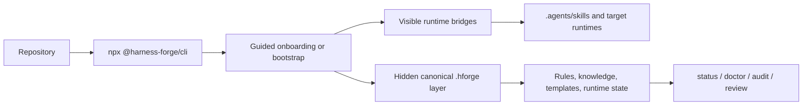

# Harness Forge

<p align="center">
  <strong>Deterministic AI workspace bootstrapping for Codex, Claude Code, and adjacent agentic runtimes.</strong>
  <br />
  Install skills, knowledge packs, workflows, validation gates, and repo intelligence into a real repository — without mixing package content with workspace state.
</p>

<p align="center">
  <!-- Replace <OWNER>, <REPO>, and workflow filenames to activate repository badges -->
  <a href="https://github.com/<OWNER>/<REPO>/actions/workflows/ci.yml">
    /<REPO>/ci.yml?branch=main&style=for-the-badge&logo=githubactions&label=build" />
  </a>
  <a href="https://www.npmjs.com/package/@harness-forge/cli">
    
  </a>
  <a href="./LICENSE.md">
    
  </a>
  <a href="https://github.com/<OWNER>/<REPO>/stargazers">
    /<REPO>?style=for-the-badge&logo=github" />
  </a>
  <a href="https://github.com/<OWNER>/<REPO>/issues">
    /<REPO>?style=for-the-badge&logo=github" />
  </a>
  
</p>

<p align="center">
  <a href="#-quick-start">Quick Start</a>
  ·
  <a href="#-why-harness-forge">Why Harness Forge</a>
  ·
  <a href="#-supported-targets">Supported Targets</a>
  ·
  <a href="#-operator-cheat-sheet">Commands</a>
  ·
  <a href="#-acknowledgements">Credits</a>
</p>

> [!TIP]
> First time here? Run `npx @harness-forge/cli` from the repository you want to equip. The CLI now acts like a guided front door for onboarding and setup.

---

## ✨ Why Harness Forge?

Harness Forge is a packaging-friendly agentic workspace kit built for teams that want **repeatable AI runtime setup** instead of ad hoc prompting.

It helps you:

- **bootstrap a real repository** with agent-ready runtime surfaces
- **compose language packs, framework packs, profiles, and capability bundles** through one CLI
- **keep workspace state clean** by separating visible bridges from the hidden canonical AI layer
- **generate repo-aware guidance** with evidence instead of guessing
- **ship with validation gates** so install quality and support claims stay honest

### What makes it different?

| Area | What Harness Forge does |
| --- | --- |
| 🧠 Agent runtime | Creates predictable runtime surfaces like `AGENTS.md`, `.agents/skills/`, `.codex/`, `.claude/`, and the hidden canonical `.hforge/` layer |
| 🧩 Composition | Lets you combine targets, profiles, languages, frameworks, and capability bundles through a single install flow |
| 🔎 Repo intelligence | Recommends packs and guidance based on the actual repo rather than generic setup assumptions |
| 🛡️ Validation | Ships doctor, audit, review, diff-install, and release-grade checks so handoff quality stays measurable |
| 🔁 Lifecycle | Supports bootstrap, refresh, upgrade, sync, prune, export, and flow recovery workflows over time |

---

## 🚀 Quick Start

### 1) Guided onboarding

```bash
npx @harness-forge/cli
```

Best for first-time operators who want:

- target selection
- setup depth selection (`quick`, `recommended`, `advanced`)
- optional module selection
- a review step before files are written

### 2) One-shot bootstrap for the current repo

```bash
npx @harness-forge/cli bootstrap --root . --yes
```

This path is ideal when you want Harness Forge to:

- detect supported agent runtimes already present
- choose a sane first-class fallback target when none are present
- recommend repo-aware packs and bundles
- install runtime files, discovery bridges, and workspace state in one pass

### 3) Validate the install

```bash
hforge status --root . --json
hforge doctor --root . --json
hforge audit --root . --json
```

---

## 🧭 Onboarding Flow



### Your first 10 minutes

1. **Run the CLI** in the target repository.
2. **Choose one or more targets** such as Codex or Claude Code.
3. **Pick a setup depth**: `quick`, `recommended`, or `advanced`.
4. **Enable optional modules** like recursive runtime, decision templates, or export support.
5. **Review planned writes** before applying anything.
6. **Confirm health** with `status`, `doctor`, and `audit`.

---

## 📦 What gets installed?

| Surface | Purpose |
| --- | --- |
| `.agents/skills/` | Thin, discoverable wrappers for agent runtimes |
| `.hforge/library/` | Hidden canonical skills, rules, templates, and knowledge packs |
| `.hforge/runtime/` | Shared runtime state, repo intelligence, findings, and decision indexes |
| `.specify/` | Structured `spec -> plan -> tasks -> implement` workflow helpers |
| `.codex/` / `.claude/` | Target-specific runtime payloads and bridge files |
| `.hforge/generated/` | Launchers, generated catalogs, and machine-readable runtime artifacts |

### Core value proposition

- **Visible where it needs to be** for runtimes and operators
- **Hidden where it should be** for the canonical AI layer
- **Structured for maintenance** instead of prompt drift

---

## 🎯 Supported Targets

Harness Forge is strongest with **Codex** and **Claude Code** today.

| Target | Runtime support | Hooks | Flow recovery | Best fit |
| --- | --- | --- | --- | --- |
| Codex | First-class | Partial, documentation-driven | First-class | Default choice for full install, recommendation, maintenance, and flow support |
| Claude Code | First-class | First-class | First-class | Best choice when native hook support matters |
| Cursor | Partial | Partial | Partial | Best for consuming docs, manifests, and recommendation output |
| OpenCode | Partial | Partial | Partial | Best for docs, manifests, and recommendation output |

> [!NOTE]
> Canonical support truth should live in `manifests/catalog/harness-capability-matrix.json`. Use `docs/target-support-matrix.md` as the operator-facing summary.

---

## 🛠️ Install Modes

| Mode | Entry point | When to use it |
| --- | --- | --- |
| Guided onboarding | `npx @harness-forge/cli` | First-time setup, interactive review, and a polished onboarding experience |
| Direct setup | `hforge init --root <repo> --agent codex --yes` | CI, scripts, automation, or operators who already know the desired target |
| Bootstrap | `npx @harness-forge/cli bootstrap --root . --yes` | Auto-detect runtimes and install a sensible target stack in one pass |
| Catalog expansion | `hforge catalog add ...` | Add languages, frameworks, or bundles as the repository evolves |

### Example installs

#### Codex

```bash
node dist/cli/index.js install \
  --target codex \
  --profile core \
  --lang typescript \
  --framework react \
  --with workflow-quality \
  --root /path/to/your/workspace \
  --yes
```

#### Claude Code

```bash
node dist/cli/index.js install \
  --target claude-code \
  --profile core \
  --lang python \
  --framework fastapi \
  --with workflow-quality \
  --root /path/to/your/workspace \
  --yes
```

---

## 🧠 Why teams adopt it

- **Deterministic installs** instead of relying on ad hoc prompts
- **Repo-aware recommendations** instead of hand-tuned tribal knowledge
- **Target support that stays explicit** instead of vague compatibility claims
- **Operational tooling built in** for validation, review, diffing, and maintenance
- **A machine-readable contract** for custom agents via `.hforge/agent-manifest.json`

---

## ⚙️ Prerequisites

| Requirement | Notes |
| --- | --- |
| Node.js 22+ | Required to build and run the CLI |
| npm | Used for install, build, validation, and bootstrap flows |
| A target repository | The workspace that should receive the installed agent surfaces |
| PowerShell | Needed for the shipped PowerShell validation bundle on Windows and cross-platform PowerShell setups |

---

## ✅ Verify everything is healthy

Run these after installation:

```bash
npx @harness-forge/cli shell setup --yes
hforge status --root /path/to/your/workspace --json
hforge refresh --root /path/to/your/workspace --json
hforge doctor --root /path/to/your/workspace --json
hforge audit --root /path/to/your/workspace --json
hforge review --root /path/to/your/workspace --json
```

### What success looks like

| Check | Signal |
| --- | --- |
| Install state | Installed targets, bundles, timestamps, and file writes are present |
| Agent command catalog | `.hforge/generated/agent-command-catalog.json` exists |
| Custom-agent manifest | `.hforge/agent-manifest.json` exists |
| Skill discovery layer | `.agents/skills/` is present |
| Canonical AI layer | `.hforge/library/skills/`, `rules/`, and `knowledge/` are populated |
| Runtime state | `.hforge/runtime/index.json` and related findings/decision files exist |
| Target runtime | `.codex/` or `.claude/` exists in the workspace |

---

## 📚 Operator Cheat Sheet

| Goal | Command |
| --- | --- |
| Initialize the hidden runtime in a repo | `npx @harness-forge/cli init --root /path/to/your/workspace --json` |
| Enable bare `hforge` on PATH | `npx @harness-forge/cli shell setup --yes` |
| Auto-detect targets and bootstrap | `npx @harness-forge/cli bootstrap --root /path/to/your/workspace --yes` |
| Inspect the catalog | `hforge catalog --json` |
| List commands agents can use | `hforge commands --json` |
| Inspect what is installed | `hforge status --root /path/to/your/workspace --json` |
| Refresh runtime summaries | `hforge refresh --root /path/to/your/workspace --json` |
| Summarize runtime health | `hforge review --root /path/to/your/workspace --json` |
| Export runtime state | `hforge export --root /path/to/your/workspace --json` |
| Generate repo-aware recommendations | `hforge recommend /path/to/your/workspace --json` |
| Build a repo map | `hforge cartograph /path/to/your/workspace --json` |
| Inspect target capabilities | `hforge target inspect codex --json` |
| Validate templates | `hforge template validate --json` |
| Compare install state vs workspace | `hforge diff-install --root /path/to/your/workspace --json` |

---

## 🔬 Repo Intelligence & Guidance Synthesis

Harness Forge can inspect a repository and recommend packs, profiles, skills, and missing validation surfaces with evidence.

```bash
hforge recommend tests/fixtures/benchmarks/typescript-web-app --json
hforge cartograph tests/fixtures/benchmarks/monorepo --json
hforge classify-boundaries tests/fixtures/benchmarks/monorepo --json
hforge synthesize-instructions tests/fixtures/benchmarks/monorepo --target codex --json
```

---

## 🧪 Release Validation

### Fast local validation

```bash
npm run validate:local
```

### Release or handoff validation

```bash
npm run release:dry-run
```

### Full release gate

```bash
npm run build
npm run validate:local
npm run smoke:cli
npm run commands:catalog
npm run bootstrap:current
npm run recommend:current
npm run cartograph:current
npm run instructions:codex
npm run target:codex
npm run target:claude-code
npm run target:opencode
npm run validate:release
npm run validate:compatibility
npm run validate:skill-depth
npm run validate:framework-coverage
npm run validate:doc-command-alignment
npm run validate:runtime-consistency
npm run observability:summary
npm run knowledge:coverage
npm run knowledge:drift
```

> [!IMPORTANT]
> `npm run validate:release` should be treated as the front-door release gate for shipped changes.

---

## 🗂️ Repository Structure

<details>
<summary><strong>Expand repository layout</strong></summary>

| Folder | Purpose |
| --- | --- |
| `.agents/` | Auto-discoverable skill wrappers and target-facing bridge surfaces |
| `.hforge/` | Hidden canonical AI layer, runtime state, templates, observability, and generated outputs |
| `.specify/` | Structured delivery flow assets (`spec -> plan -> tasks -> implement`) |
| `dist/` | Built CLI output from the TypeScript source tree |
| `docs/` | Front-door documentation, catalogs, target guidance, and lifecycle docs |
| `knowledge-bases/` | Source-authored seeded and structured knowledge packs |
| `manifests/` | Catalogs, bundles, profiles, target definitions, and package metadata |
| `scripts/` | CI, runtime, knowledge, intelligence, validation, and maintenance scripts |
| `skills/` | Source-authored canonical packaged skills and reference packs |
| `src/` | TypeScript implementation of the CLI and supporting layers |
| `targets/` | Target adapters and runtime payloads for supported harnesses |
| `templates/` | Reusable task, instruction, and workflow templates |
| `tests/` | Contract, integration, and fixture coverage |

</details>

---

## 📖 Read Order for Custom Agents

When integrating a custom agent, start here:

1. `AGENTS.md`
2. `.hforge/agent-manifest.json`
3. `.hforge/runtime/index.json`
4. `.hforge/generated/agent-command-catalog.json`
5. `.agents/skills/<skill>/SKILL.md`
6. `.hforge/library/skills/<skill>/SKILL.md`

---

## 🙌 Acknowledgements

Harness Forge was inspired by [github/spec-kit](https://github.com/github/spec-kit).

A lot of the thinking around structured specification flow, disciplined planning, and operator-friendly delivery benefited from that inspiration. Big credit to the GitHub team for helping shape a cleaner workflow model.

---

## 📄 License

This project is licensed under **GPL-3.0**. See [LICENSE.md](./LICENSE.md).

---

<p align="center">
  Built for teams who want their agent workflows to be <strong>repeatable</strong>, <strong>inspectable</strong>, and <strong>release-safe</strong>.
</p>
