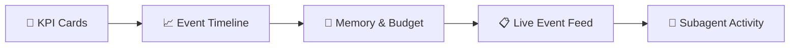

<p align="center">
  
</p>

<h1 align="center">🔨 Harness Forge</h1>

<p align="center">
  <strong>Make AI coding agents actually useful in your repository.</strong>
  <br />
  One command to set up Codex, Claude Code, or both &mdash; with the right context, skills, and workflows for your codebase.
</p>

<p align="center">
  <a href="https://github.com/ldilov/harness-forge/actions/workflows/ci.yml">
    
  </a>
  <a href="https://www.npmjs.com/package/@harness-forge/cli">
    
  </a>
  <a href="https://www.npmjs.com/package/@harness-forge/cli">
    
  </a>
  <a href="https://www.npmjs.com/package/@harness-forge/cli">
    
  </a>
</p>
<p align="center">
  <a href="https://github.com/ldilov/harness-forge/stargazers">
    
  </a>
  <a href="https://github.com/ldilov/harness-forge/network/members">
    
  </a>
  <a href="https://github.com/ldilov/harness-forge/issues">
    
  </a>
  <a href="./LICENSE">
    
  </a>
  
</p>

<p align="center">
  <a href="#-get-started-in-60-seconds">🚀 Get Started</a> &bull;
  <a href="#-what-does-it-do">✨ What It Does</a> &bull;
  <a href="#-everyday-commands">⌨️ Commands</a> &bull;
  <a href="#-real-time-dashboard">📊 Dashboard</a> &bull;
  <a href="#-real-world-scenarios">💡 Scenarios</a> &bull;
  <a href="#-supported-targets">🎯 Targets</a> &bull;
  <a href="#-faq">❓ FAQ</a>
</p>

---

## 📈 Project Activity

<p align="center">
  <a href="https://star-history.com/#ldilov/harness-forge&Date">
    
  </a>
</p>

---

## 💡 What is Harness Forge?

> **In plain English:** Harness Forge makes AI coding assistants (like Codex or Claude Code) work better in your project by giving them the right context, skills, and rules — automatically.

Without it, your AI assistant has to guess what your project looks like. With it, the assistant knows your languages, frameworks, file structure, and coding conventions from the start.

Think of it as a one-time setup that:

- 🔍 **Scans** your project and figures out what languages, frameworks, and tools you use
- 🧠 **Recommends** the best configuration for your AI assistant
- 📦 **Installs** skills, knowledge, and workflows that help the assistant write better code
- 🔧 **Keeps everything updated** as your project grows

| | Without Harness Forge | With Harness Forge |
|---|---|---|
| 🧠 **Context** | Agent guesses at project structure | Agent knows your languages, frameworks, boundaries |
| 🔧 **Skills** | Generic, one-size-fits-all | Tailored to your stack and workflow |
| 📋 **Workflow** | Ad hoc, inconsistent | Structured, repeatable, validated |
| 🔄 **Continuity** | Starts from scratch each session | Persistent runtime state across sessions |
| 🎯 **Targeting** | Same behavior for all tools | Codex, Claude Code, Cursor tuned separately |

---

<p align="center">
  
  
  
  
  
</p>

---

## 🚀 Get Started in 60 Seconds

### Install and set up your repo

```bash
npx @harness-forge/cli
```

That's it. The CLI walks you through:

1. Which AI targets to set up (Codex, Claude Code, or both)
2. How deep to go (`quick`, `recommended`, or `advanced`)
3. Which optional features to include
4. A preview of exactly what files will be created

> **Tip:** Already know what you want? Use the one-liner:
> ```bash
> npx @harness-forge/cli init --root . --agent codex --setup-profile recommended --yes
> ```

### Make `hforge` available everywhere

```bash
npx @harness-forge/cli shell setup --yes
```

Now you can use `hforge` directly instead of `npx @harness-forge/cli`.

### Check that everything is healthy

```bash
hforge doctor --root . --json
```

---

## ✨ What Does It Do?

### 🔍 It understands your repo

```bash
hforge recommend . --json        # What setup makes sense for this repo?
hforge cartograph . --json       # Map the repo structure
hforge scan . --json             # Detect languages, frameworks, tools
```

Harness Forge scans your codebase and recommends the right targets, profiles, and skill packs &mdash; with evidence for each recommendation.

### 🧩 It equips your AI assistant

After setup, your repo contains:

| What gets created | What it does |
|---|---|
| `AGENTS.md` | Entry point that tells the AI assistant how your workspace is organized |
| `.agents/skills/` | Skills the assistant can discover and use (code review, testing, debugging, etc.) |
| `.hforge/` | Hidden runtime with knowledge packs, rules, templates, and workspace state |
| `.codex/` or `.claude/` | Target-specific configuration for your chosen AI assistant |

#### Why this matters

<details>
<summary><strong>🎯 Better accuracy</strong> — fewer hallucinations, fewer wrong guesses</summary>

Without context, AI assistants guess at your project structure, naming conventions, and patterns. They might suggest Express.js code in a FastAPI project, or use `var` in a TypeScript codebase that uses `const`. Harness Forge gives the assistant a map of your repo — languages, frameworks, file boundaries, coding rules — so it generates code that actually fits your project from the first try.

</details>

<details>
<summary><strong>🧠 Better handling of complex logic</strong> — structured skills instead of improvisation</summary>

When your assistant has packaged skills (code review checklists, debugging workflows, testing strategies), it follows a structured approach instead of improvising. For example, a "debug" skill tells the assistant to reproduce the bug first, isolate the component, check recent changes, then propose a fix — instead of jumping straight to rewriting code. This makes a real difference on tasks that span multiple files or require understanding data flow across services.

</details>

<details>
<summary><strong>💰 Lower costs</strong> — less wasted context, fewer retries</summary>

AI assistants charge by tokens (the text they read and write). Without good context, the assistant wastes tokens asking clarifying questions, exploring wrong paths, and regenerating code after misunderstandings. Harness Forge's **compaction system** actively manages the assistant's context window — compressing old information, rotating memory, and keeping only what's relevant. The **subagent brief system** sends focused, minimal context to sub-tasks instead of dumping everything. Less wasted context = fewer tokens = lower costs.

</details>

<details>
<summary><strong>🔄 Consistency across sessions</strong> — the assistant remembers what it learned</summary>

Normally, every time you start a new conversation with your AI assistant, it starts from scratch. Harness Forge maintains **persistent runtime state** — session summaries, accepted decisions, working memory — so the assistant picks up where it left off. It remembers that you decided to use Repository pattern, that the auth module is off-limits for refactoring, and that tests should use Vitest not Jest.

</details>

<details>
<summary><strong>📊 Full visibility</strong> — see every decision the harness makes</summary>

Run `hforge dashboard` to open a real-time browser dashboard showing memory pressure, budget usage, compaction history, and every event as it happens. No black boxes — you can see exactly why the assistant's context was compressed, when memory was rotated, and how token budget is being spent. See [docs/dashboard.md](./docs/dashboard.md).

</details>

### 🛡️ It keeps things healthy over time

```bash
hforge status --root . --json     # What is installed?
hforge refresh --root . --json    # Regenerate runtime after changes
hforge review --root . --json     # Health check and readiness review
hforge next --root .              # What should I do next in this workspace?
```

---

## ⌨️ Everyday Commands

### 📥 Setup

| What you want to do | Command |
|---|---|
| Set up a new repo (guided) | `npx @harness-forge/cli` |
| Set up a new repo (one-liner) | `hforge init --root . --agent codex --setup-profile recommended --yes` |
| Auto-detect and bootstrap | `hforge bootstrap --root . --yes` |
| Preview without writing files | `hforge init --root . --agent codex --dry-run` |
| Enable `hforge` on your PATH | `hforge shell setup --yes` |

### 🔄 Daily use

| What you want to do | Command |
|---|---|
| What should I do next? | `hforge next --root .` |
| Check workspace health | `hforge doctor --root . --json` |
| Refresh the runtime | `hforge refresh --root . --json` |
| Review install state | `hforge status --root . --json` |
| Check flow status | `hforge flow status --root . --json` |
| Inspect target details | `hforge target inspect codex --root .` |
| Compare Codex vs Claude Code | `hforge target compare codex claude-code` |

### 🔧 Maintenance

| What you want to do | Command |
|---|---|
| Update Harness Forge in place | `hforge update --root . --yes` |
| Export runtime for handoff | `hforge export --root . --json` |
| Audit install integrity | `hforge audit --root . --json` |
| Check what drifted | `hforge diff-install --root . --json` |
| Validate locally before push | `npm run validate:local` |
| Validate for release | `npm run validate:release` |
| Dry-run a release | `npm run release:dry-run` |

---

## 📊 Real-Time Dashboard

See what the harness is doing — live, in your browser.

```bash
hforge dashboard
```

This opens a visual dashboard that shows:



- **Memory pressure** — how close you are to running out of context space
- **Compaction history** — when and how aggressively context was compressed
- **Budget gauge** — token usage with color-coded threshold zones
- **Live event feed** — searchable, expandable table of every harness decision
- **Subagent briefs** — what tasks were delegated and how
- **Desktop notifications** — get alerted when something critical happens (budget exceeded, memory rotation)

> **Multi-project support:** The dashboard works across all your projects. When you open it, you pick which project to monitor. Your project list is saved in the browser so you don't re-add them every time.

For the full guide, see [docs/dashboard.md](./docs/dashboard.md).

---

## 💡 Real-World Scenarios

### 📂 Scenario 1: "I just cloned a repo and want AI help"

```bash
cd my-project
npx @harness-forge/cli
# Follow the step-by-step setup
# Done! Your AI assistant now understands this project
```

### 🤝 Scenario 2: "I use both Codex and Claude Code"

```bash
hforge init --root . --agent codex --agent claude-code --setup-profile recommended --yes
```

Both agents share the same hidden runtime (`.hforge/`) but get their own configuration bridges. Run `hforge target compare codex claude-code` to see the differences.

### 🔙 Scenario 3: "I come back to a repo after a while"

```bash
hforge next --root .
# Harness Forge tells you the most useful action right now
# Usually: refresh the runtime, run a health check, or review stale artifacts
```

### 👥 Scenario 4: "I want to standardize AI setup across my team's repos"

```bash
# Same command in every repo, same result
hforge init --root . --agent codex --setup-profile recommended --yes
hforge doctor --root . --json   # Verify it's healthy
hforge export --root . --json   # Share the runtime state
```

### 🧬 Scenario 5: "A task is really hard and needs structured recursive analysis"

Use structured recursive analysis to break down complex investigations:

```bash
hforge recursive plan "investigate the billing retry flow" --task-id TASK-001 --json
hforge recursive capabilities --root . --json
```

For a full walkthrough, see [./docs/recursive-rlm-guide.md](./docs/recursive-rlm-guide.md).

Or let your AI agent decide when to escalate:

```
/hforge-recursive-investigate investigate the billing retry flow across API and worker boundaries
```

---

## 🔄 Updating

### Update Harness Forge to the latest version

```bash
hforge update --root . --yes
```

This downloads the latest published version and refreshes all managed surfaces while **keeping your workspace state** (task artifacts, decision records, recursive sessions, and observability data).

### Preview what an update would change

```bash
hforge update --root . --dry-run --yes
```

### Update globally

```bash
npm install -g @harness-forge/cli@latest
```

---

## 🎯 Supported Targets

| Target | Support Level | Best for |
|---|---|---|
| **Codex** | Full | Default choice &mdash; full install, maintenance, and runtime support |
| **Claude Code** | Full | When you need native hooks and plugin support |
| **Cursor** | Partial | Docs and manifests work; runtime features are limited |
| **OpenCode** | Partial | Docs and manifests work; runtime features are limited |

### ⚖️ Codex vs Claude Code

Both are first-class targets. The main difference is **hook support**:

| | Codex | Claude Code |
|---|---|---|
| Runtime | ✅ Full | ✅ Full |
| Maintenance | ✅ Full | ✅ Full |
| Hooks | 📄 Documentation-driven | ✅ Native |
| Plugins | 📄 Manual wiring | ✅ Native |
| Shared `.hforge/` | ✅ Yes | ✅ Yes |

Use both together when your team works with multiple tools. They share the same `.hforge/` runtime.

```bash
hforge target compare codex claude-code        # See all differences
hforge target compare codex claude-code --json  # Machine-readable comparison
```

---

## 📦 What's Included

### 🌐 Language packs (14 languages)

TypeScript, Python, Java, Go, Kotlin, Rust, C++, .NET, PHP, Perl, Swift, Shell, Lua, PowerShell

### 🏗️ Framework packs (12 frameworks)

React, Next.js, Vite, Express, FastAPI, Django, ASP.NET Core, Spring Boot, Laravel, Symfony, Gin, Ktor

### 🛠️ Skills (45+ packaged skills)

Language engineering, workflow orchestration, operational helpers, and specialized skills like incident triage, dependency upgrades, API contract review, database migration review, release readiness, and token-budget-optimizer for context-aware compaction.

---

## ⚙️ How It Works

```
Your Repo
  |
  |-- npx @harness-forge/cli
  |
  |-- Scans repo (languages, frameworks, targets)
  |-- Recommends setup (targets, profile, packs)
  |-- Installs runtime
  |       |
  |       |-- AGENTS.md              (visible to AI agents)
  |       |-- .agents/skills/        (discoverable skills)
  |       |-- .codex/ or .claude/    (target config)
  |       |-- .hforge/               (hidden canonical runtime)
  |              |-- library/        (skills, rules, knowledge)
  |              |-- runtime/        (state, indexes, findings)
  |              |-- generated/      (command catalog, launchers)
  |              |-- templates/      (workflow templates)
  |
  |-- hforge next                    (what to do now?)
  |-- hforge doctor                  (is everything healthy?)
  |-- hforge refresh                 (regenerate after changes)
```

The key idea: **visible bridges** where AI agents need discovery, **hidden canonical layer** where runtime content should stay authoritative.

---

## 🧪 Advanced Features

### 🧭 `hforge next` &mdash; Your daily starting point

Instead of wondering which command to run, just ask:

```bash
hforge next --root .
```

It checks your workspace state and recommends the single most useful action &mdash; with a reason and confidence level.

```bash
hforge next --root . --json              # Machine-readable output
hforge next --root . --apply-safe-fixes  # Auto-run if the action is safe
hforge next --root . --verbose           # Show full reasoning
```

### 🧬 Recursive runtime &mdash; For hard problems

When a task is complex enough to need structured investigation:

```bash
hforge recursive plan "investigate billing retry behavior" --task-id TASK-001 --json
hforge recursive execute RS-123 --file bundle.json --json
hforge recursive score RS-123 --json
```

This creates a durable session with working memory, checkpoints, typed action bundles, and replay capability.

### 🔬 Repo intelligence

```bash
hforge recommend . --json                  # Evidence-backed setup recommendations
hforge cartograph . --json                 # Map repo structure and boundaries
hforge classify-boundaries . --json        # Identify service boundaries
hforge synthesize-instructions . --target codex --json  # Generate target-specific guidance
```

---

## ❓ FAQ

<details>
<summary><strong>Do I need to install anything globally?</strong></summary>

No. `npx @harness-forge/cli` runs directly without installing anything. If you want the shorter `hforge` command, run `hforge shell setup --yes` once.
</details>

<details>
<summary><strong>Does it change my source code?</strong></summary>

No. Harness Forge only creates its own files (`AGENTS.md`, `.agents/`, `.hforge/`, `.codex/`, `.claude/`). Your application code is never touched.
</details>

<details>
<summary><strong>Can I use it in CI/CD pipelines?</strong></summary>

Yes. Add `--yes` for non-interactive mode and `--json` for machine-readable output:
```bash
hforge init --root . --agent codex --setup-profile recommended --yes
hforge doctor --root . --json
```
</details>

<details>
<summary><strong>How do I remove it from a project?</strong></summary>

Delete these directories and files: `.hforge/`, `.agents/`, `.codex/`, `.claude/`, `AGENTS.md`. Your project is back to normal.
</details>

<details>
<summary><strong>Does it send any data to the internet?</strong></summary>

No. All data stays on your machine under `.hforge/observability/`. Nothing is ever sent anywhere. You can inspect, delete, or back up these files anytime.
</details>

<details>
<summary><strong>What Node.js version do I need?</strong></summary>

Node.js 22 or newer. Check with `node --version`.
</details>

<details>
<summary><strong>What's the real-time dashboard?</strong></summary>

Run `hforge dashboard` to open a browser-based view of what the harness is doing. It shows memory usage, compaction decisions, budget status, and a live event feed. See [docs/dashboard.md](./docs/dashboard.md) for details.
</details>

---

## 🤝 Contributing

See [CONTRIBUTING.md](./CONTRIBUTING.md) for development setup and guidelines.

## 🙌 Acknowledgements

Harness Forge was inspired by [github/spec-kit](https://github.com/github/spec-kit). Credit to the GitHub team for shaping cleaner workflow models.

## 📄 License

GPL-3.0 &mdash; see [LICENSE](./LICENSE).

---

<p align="center">
  <strong>Make your AI agents better at their job.</strong>
  <br />
  <code>npx @harness-forge/cli</code>
</p>
