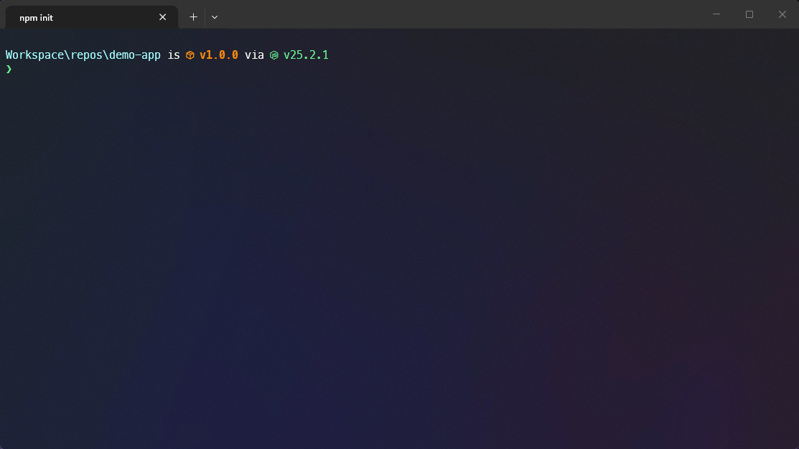
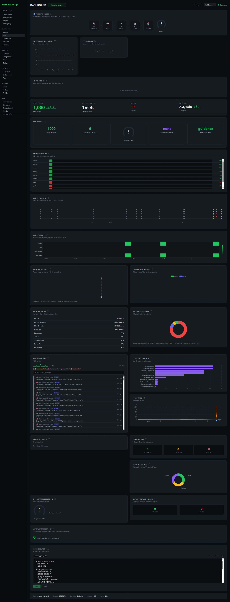

<p align="center">
  
</p>

<h1 align="center">🔨 Harness Forge</h1>

<p align="center">
  <strong>Your AI coding agent is only as good as its harness.</strong>
  <br />
  One command to scan, equip, and continuously improve any AI coding agent in your repository.
</p>

<p align="center">
  
</p>

<p align="center">
  <a href="https://github.com/ldilov/harness-forge/actions/workflows/ci.yml">
    
  </a>
  <a href="https://www.npmjs.com/package/@harness-forge/cli">
    
  </a>
  <a href="https://www.npmjs.com/package/@harness-forge/cli">
    
  </a>
  <a href="https://github.com/ldilov/harness-forge/stargazers">
    
  </a>
  <a href="./LICENSE">
    
  </a>
  
</p>

<p align="center">
  <a href="#-get-started-in-60-seconds">🚀 Get Started</a> &bull;
  <a href="#-the-living-loop--your-harness-gets-smarter">🔄 Living Loop</a> &bull;
  <a href="#-real-time-dashboard">📊 Dashboard</a> &bull;
  <a href="#-your-daily-workflow">⌨️ Commands</a> &bull;
  <a href="#-real-world-scenarios">💡 Scenarios</a> &bull;
  <a href="#-supported-targets">🎯 Targets</a> &bull;
  <a href="#-faq">❓ FAQ</a>
</p>

---

<!-- LAYER 1: What is this? (5 seconds) -->

<table>
<tr>
<td align="center" width="33%">

### 🔍 Scans & Equips

Your AI agent gets your repo's languages,
frameworks, and patterns **from the first prompt**

</td>
<td align="center" width="33%">

### 🔄 Self-Improves

A closed feedback loop **learns** what works,
**tunes** itself, and gets smarter every session

</td>
<td align="center" width="33%">

### 📊 Full Visibility

Real-time dashboard shows every decision,
token spend, and compaction — **no black boxes**

</td>
</tr>
</table>

<br />

|  | Without Harness Forge | With Harness Forge |
|---|---|---|
| 🧠 **Context** | Agent guesses at project structure | Agent knows your languages, frameworks, boundaries |
| ⚡ **Performance** | Starts fresh every session | Self-improves over time via the Living Loop |
| 📊 **Visibility** | Black box — no idea what the agent decided | Real-time dashboard with 20 live panels |
| 💰 **Cost** | Wasted tokens on retries and wrong paths | Compaction + auto-tuning saves 20-40% |
| 📤 **Portability** | Stuck on one machine, one setup | Export & import learned patterns as `.hfb` bundles |

<p align="center">
  
  
  
  
  
</p>

<p align="center">
  
  
  
</p>

---

<!-- LAYER 2: The differentiators (15 seconds) -->

## 🔄 The Living Loop — Your Harness Gets Smarter

> Most tools configure once and forget. Harness Forge **keeps learning.**

<p align="center">

```
  ┌──────────┐    ┌──────────┐    ┌──────────┐    ┌──────────┐    ┌──────────┐
  │ 🔍       │    │ 🧠       │    │ ⚡       │    │ 📤       │    │ 📥       │
  │ OBSERVE  │───▶│  LEARN   │───▶│  ADAPT   │───▶│  SHARE   │───▶│  IMPORT  │
  │          │    │          │    │          │    │          │    │          │
  │ Tracks   │    │ Finds    │    │ Auto-    │    │ Export   │    │ Bootstrap│
  │ sessions │    │ patterns │    │ tunes    │    │ bundles  │    │ anywhere │
  └──────────┘    └──────────┘    └──────────┘    └──────────┘    └──────────┘
        ▲                                                              │
        └──────────────────────────────────────────────────────────────┘
```

</p>

<table>
<tr>
<td width="50%">

#### 📅 Day 1 — You install

```bash
npx @harness-forge/cli
```

Scans your repo. Installs skills, rules, knowledge packs.
Default settings. Everything works out of the box.

</td>
<td width="50%">

#### 📅 Day 3 — After ~10 sessions

```
🧠 Pattern found: "Summarize" saves 40% more tokens
   than "Trim" in this repo (confidence: 82%)

⚡ Auto-tuned: compaction threshold 75% → 65%
   Result: 20% fewer budget warnings
```

</td>
</tr>
<tr>
<td width="50%">

#### 📅 Day 5 — Share with your team

```bash
hforge export --bundle my-team.hfb
# Send to a teammate →
hforge import my-team.hfb
# They get your learned patterns instantly
```

</td>
<td width="50%">

#### 📅 Ongoing — Dashboard shows it all

```bash
hforge dashboard
```

Loop health ring, effectiveness scores,
pattern list, tuning log — live in your browser.

</td>
</tr>
</table>

> **The more you use it, the better it gets.** After ~10 sessions, Harness Forge has learned your repo's patterns and tuned itself for optimal performance. No manual configuration needed.

<details>
<summary><strong>🛡️ Guardrails — auto-tuning is safe</strong></summary>

- Every tunable parameter has **hard min/max bounds** — the tuner can't go wild
- Every change is logged with **before/after values** and the pattern that triggered it
- If the next 3 sessions score worse, the tuning is **automatically reverted**
- Your manual config overrides are **sacred** — the tuner won't touch them
- The dashboard shows every tuning with a **one-click revert** button

</details>

---

## 📊 Real-Time Dashboard

> `hforge dashboard` — see everything, live in your browser.

<p align="center">
  
</p>

<p align="center">
  
  
  
</p>

<table>
<tr>
<td align="center" width="25%">

#### 🔄 Loop Ring

Live status of each loop
stage with health score

</td>
<td align="center" width="25%">

#### 📈 Effectiveness

Session score trend —
are things getting better?

</td>
<td align="center" width="25%">

#### 🧠 Insights

Discovered patterns with
confidence bars

</td>
<td align="center" width="25%">

#### ⚡ Tuning Log

Policy changes with
one-click revert

</td>
</tr>
</table>

<details>
<summary><strong>📋 All 20 dashboard panels</strong></summary>

| Panel | What it shows |
|-------|-------------|
| 🔢 **KPI Cards** | Total events, tokens, enforcement level, budget gauge |
| 📈 **Event Timeline** | Scatter plot of all events over time, color-coded by category |
| 💾 **Memory Pressure** | Token usage line chart with threshold marklines |
| 📊 **Budget Breakdown** | Donut chart of budget allocation (hot-path, output, tools, safety) |
| 📋 **Live Event Feed** | Searchable, expandable table of every harness decision |
| 🤖 **Subagent Briefs** | Delegated tasks, their context, and outcomes |
| 📊 **Brief Metrics** | Subagent activity summary and success rates |
| 🔇 **Suppression Gauge** | How many duplicate context items were removed |
| 🚪 **Expansion Gate** | History access requests — granted vs denied |
| ⚙️ **Config Editor** | Edit memory-policy, context-budget, load-order live |
| 🔄 **Loop Health Ring** | Self-improvement cycle status with stage counts |
| 📈 **Effectiveness Trend** | Session score sparkline (last 20 sessions) |
| 🧠 **Insights Panel** | Discovered patterns with confidence and "NEW" badges |
| ⚡ **Tuning Log** | Policy changes with before/after and revert button |
| 📊 **Event Distribution** | Bar chart of top event types |
| ⏱️ **Event Rate** | Events per minute over time |
| 🗺️ **Event Heatmap** | Category × time heatmap |
| 💰 **Tokens Saved** | Running counter of tokens saved by compaction |
| 📊 **Profile Distribution** | Output profile selection breakdown |
| ℹ️ **Session Info** | Session ID, uptime, version, connection status |

</details>

> 🔔 **Desktop notifications** for critical events — budget exceeded, memory rotation, tuning applied, pattern discovered.

> 🏢 **Multi-project support** — switch between projects in one dashboard. Your project list is saved in the browser.

---

<!-- LAYER 3: Getting started and daily use (1 minute) -->

## 🚀 Get Started in 60 Seconds

<table>
<tr>
<td width="55%">

```bash
npx @harness-forge/cli
```

The CLI walks you through:

1. 🎯 Which AI targets (Codex, Claude Code, or both)
2. 📊 How deep (`quick` / `recommended` / `advanced`)
3. 👀 Preview of exactly what gets created
4. ✅ One confirmation and you're done

Then make `hforge` available on your PATH:

```bash
npx @harness-forge/cli shell setup --yes
```

</td>
<td width="45%" align="center">

**One-liner for CI / scripts:**

```bash
hforge init \
  --root . \
  --agent codex \
  --agent claude-code \
  --setup-profile recommended \
  --yes
```

**Verify everything is healthy:**

```bash
hforge doctor --root . --json
```

</td>
</tr>
</table>

---

## ⌨️ Your Daily Workflow

> Commands organized by **when** you use them — not alphabetically.

### 🌅 Starting a session

| | Command | What it does |
|---|---|---|
| 💡 | `hforge next` | Recommends the single most useful action right now |
| 🏥 | `hforge doctor` | Full health check with evidence |
| 🔄 | `hforge refresh` | Regenerate runtime after code changes |
| 📋 | `hforge status` | Review what's installed |

### 🔄 While working

| | Command | What it does |
|---|---|---|
| 📊 | `hforge dashboard` | Open the real-time browser dashboard |
| 📈 | `hforge score` | Show recent session effectiveness scores |
| 🧠 | `hforge insights` | Browse learned patterns with confidence |
| ⚡ | `hforge adapt` | View/manage auto-tunings |
| 🔍 | `hforge trace` | View recent session traces |
| 🔄 | `hforge loop` | Living Loop health summary |

### 📤 Sharing & maintenance

| | Command | What it does |
|---|---|---|
| 📦 | `hforge export --bundle team.hfb` | Export tuned harness as portable bundle |
| 📥 | `hforge import team.hfb` | Bootstrap from a shared bundle |
| 🔧 | `hforge update` | Update harness to latest version in place |
| 🔬 | `hforge audit` | Verify install integrity |
| 🔎 | `hforge diff-install` | Check what drifted since last install |
| 🧹 | `hforge prune` | Clean up unused artifacts |

### 🧬 Advanced

| | Command | What it does |
|---|---|---|
| 🗺️ | `hforge cartograph` | Map repo structure and boundaries |
| 🔍 | `hforge recommend` | Evidence-backed setup recommendations |
| 🧬 | `hforge recursive plan "..."` | Structured recursive analysis for hard problems |
| 🎯 | `hforge target compare codex claude-code` | Side-by-side target comparison |

---

## 💡 Real-World Scenarios

<table>
<tr>
<td width="50%">

#### 📂 "Just cloned a repo, want AI help"

```bash
cd my-project
npx @harness-forge/cli
# Done — AI assistant understands this project
```

</td>
<td width="50%">

#### 🤝 "I use both Codex and Claude Code"

```bash
hforge init --agent codex --agent claude-code --yes
hforge target compare codex claude-code
```

Both agents share `.hforge/` but get their own config bridges.

</td>
</tr>
<tr>
<td width="50%">

#### 🔙 "Coming back to a project after a break"

```bash
hforge next
# Tells you: refresh runtime, review stale artifacts
```

</td>
<td width="50%">

#### 👥 "Standardize AI setup across my team"

```bash
hforge export --bundle our-team.hfb
# Teammate runs:
hforge import our-team.hfb
# Same learned patterns, instant bootstrap
```

</td>
</tr>
</table>

---

## 🎯 Supported Targets

<p align="center">
  
  
  
  
</p>

<table>
<tr>
<td width="50%">

| | Codex | Claude Code |
|---|---|---|
| Runtime | ✅ Full | ✅ Full |
| Maintenance | ✅ Full | ✅ Full |
| Hooks | 📄 Docs-driven | ✅ Native |
| Plugins | 📄 Manual | ✅ Native |
| Shared `.hforge/` | ✅ Yes | ✅ Yes |

</td>
<td width="50%">

**Use both together** — they share the same `.hforge/` runtime.

```bash
hforge target compare codex claude-code
```

</td>
</tr>
</table>

---

## 📦 What's Included

<p align="center">
  
  
  
</p>

<details>
<summary><strong>🌐 14 Language packs</strong></summary>

TypeScript, Python, Java, Go, Kotlin, Rust, C++, .NET, PHP, Perl, Swift, Shell, Lua, PowerShell

</details>

<details>
<summary><strong>🏗️ 12 Framework packs</strong></summary>

React, Next.js, Vite, Express, FastAPI, Django, ASP.NET Core, Spring Boot, Laravel, Symfony, Gin, Ktor

</details>

<details>
<summary><strong>🛠️ 45+ Skills</strong></summary>

Language engineering, workflow orchestration, operational helpers, and specialized skills like incident triage, dependency upgrades, API contract review, database migration review, release readiness, and token-budget-optimizer for context-aware compaction.

</details>

---

## ⚙️ How It Works Under the Hood

<details>
<summary><strong>🗂️ What gets created in your repo</strong></summary>

```
Your Repo
  │
  ├── AGENTS.md              ← AI agents read this first
  ├── .agents/skills/        ← Discoverable skills
  ├── .codex/ or .claude/    ← Target-specific config
  └── .hforge/               ← Hidden canonical runtime
         ├── library/        ← Skills, rules, knowledge packs
         ├── runtime/        ← State, indexes, traces, insights
         ├── generated/      ← Command catalog, launchers
         └── templates/      ← Workflow templates
```

**Visible bridges** where AI agents need discovery. **Hidden canonical layer** where runtime content stays authoritative.

</details>

---

## ❓ FAQ

<details>
<summary><strong>Do I need to install anything globally?</strong></summary>

No. `npx @harness-forge/cli` runs directly. For the shorter `hforge` command, run `hforge shell setup --yes` once.

</details>

<details>
<summary><strong>Does it change my source code?</strong></summary>

Never. Harness Forge only creates its own files (`AGENTS.md`, `.agents/`, `.hforge/`, `.codex/`, `.claude/`). Your application code is untouched.

</details>

<details>
<summary><strong>Can I use it in CI/CD?</strong></summary>

Yes. Add `--yes` for non-interactive and `--json` for machine-readable output:
```bash
hforge init --root . --agent codex --setup-profile recommended --yes
hforge doctor --root . --json
```

</details>

<details>
<summary><strong>How do I remove it?</strong></summary>

Delete: `.hforge/`, `.agents/`, `.codex/`, `.claude/`, `AGENTS.md`. Your project is back to normal.

</details>

<details>
<summary><strong>Does it send data anywhere?</strong></summary>

No. Everything stays local under `.hforge/`. Nothing is ever sent to the internet. Inspect, delete, or back up anytime.

</details>

<details>
<summary><strong>What Node.js version?</strong></summary>

Node.js 22 or newer. Check with `node --version`.

</details>

---

## 📈 Project Activity

<p align="center">
  <a href="https://star-history.com/#ldilov/harness-forge&Date">
    
  </a>
</p>

---

## 🤝 Contributing

See [CONTRIBUTING.md](./CONTRIBUTING.md) for development setup and guidelines.

## 🙌 Acknowledgements

Harness Forge was inspired by [github/spec-kit](https://github.com/github/spec-kit). Credit to the GitHub team for shaping cleaner workflow models.

## 📄 License

GPL-3.0 — see [LICENSE](./LICENSE).

---

<p align="center">
  <strong>Your AI agent deserves a better harness.</strong>
  <br />
  <code>npx @harness-forge/cli</code>
</p>
