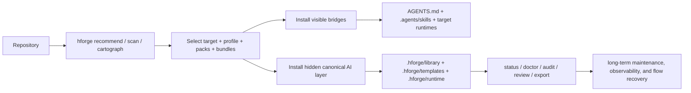
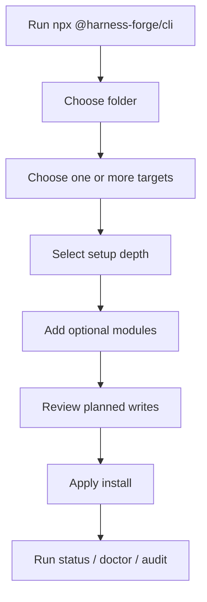

# 🚀 Harness Forge

<p align="center">
  <strong>Deterministic AI workspace bootstrapping for Codex, Claude Code, and adjacent agentic runtimes.</strong>
  <br />
  Install skills, knowledge packs, workflows, validation gates, and repo intelligence into a real repository - without mixing package content with workspace state.
</p>

<p align="center">
  <a href="https://github.com/ldilov/harness-forge/actions/workflows/ci.yml">
    
  </a>
  <a href="https://www.npmjs.com/package/@harness-forge/cli">
    
  </a>
  <a href="https://www.npmjs.com/package/@harness-forge/cli">
    
  </a>
  <a href="https://www.npmjs.com/package/@harness-forge/cli">
    
  </a>
  <a href="https://github.com/ldilov/harness-forge/stargazers">
    
  </a>
  <a href="https://github.com/ldilov/harness-forge/network/members">
    
  </a>
  <a href="https://github.com/ldilov/harness-forge/issues">
    
  </a>
  <a href="./LICENSE.md">
    
  </a>
  
</p>

<p align="center">
  <a href="#-quick-start">Quick Start</a>
  ·
  <a href="#-project-activity">Project Activity</a>
  ·
  <a href="#-why-harness-forge">Why Harness Forge</a>
  ·
  <a href="#-how-it-works">How It Works</a>
  ·
  <a href="#-supported-targets">Supported Targets</a>
  ·
  <a href="#-operator-cheat-sheet">Commands</a>
  ·
  <a href="#-acknowledgements">Credits</a>
</p>

> [!TIP]
> First time here? Run `npx @harness-forge/cli` from the repository you want to equip. Harness Forge acts like a guided front door for onboarding on first run and a lightweight project hub after initialization.

---

## 📈 Project Activity

<p align="center">
  <a href="https://star-history.com/#ldilov/harness-forge&Date">
    
  </a>
</p>

<p align="center">
  <strong>Point-in-time signals:</strong> live stars, forks, issues, and npm download badges above, plus a historical star timeline chart here.
</p>

---

## ✨ Why Harness Forge?

Harness Forge is a packaging-friendly agentic workspace kit for teams that want a **repeatable, inspectable, and maintenance-safe AI runtime** inside real repositories.

Instead of relying on one-off prompts or tribal setup knowledge, it gives you a deterministic way to:

- **bootstrap agent-ready runtime surfaces** into a real repo
- **compose targets, profiles, language packs, framework packs, and capability bundles** through one CLI
- **keep product code and workspace state cleanly separated**
- **generate repo-aware guidance with evidence** instead of generic assumptions
- **validate what ships** before release, handoff, or adoption across teams

### What makes it different?

| Area | What Harness Forge does | Why it matters |
| --- | --- | --- |
| 🧠 Runtime surfaces | Materializes `AGENTS.md`, `.agents/skills/`, target runtimes, and a canonical hidden `.hforge/` layer | Agents get a predictable operating contract instead of improvising from prose |
| 🔎 Repo intelligence | Scans, recommends, cartographs, classifies boundaries, and synthesizes instructions | Setup becomes evidence-backed rather than guess-based |
| 🧩 Composition | Combines targets, profiles, languages, frameworks, and capability bundles | Teams can standardize without hard-coding one stack |
| 🛡️ Validation | Ships doctor, audit, diff-install, review, and release gates | Support claims stay honest and installs stay measurable |
| 🔁 Lifecycle | Supports bootstrap, refresh, sync, prune, upgrade, export, backup, repair, and restore flows | The workspace can evolve without becoming a black box |
| 📊 Observability | Keeps local-first effectiveness summaries and signal files under `.hforge/observability/` | Operators can inspect what is working without sending telemetry to a backend |

---

## 🧬 Capability Snapshot

| Domain | Coverage |
| --- | --- |
| 🎯 Runtime targets | 4 target surfaces: Codex, Claude Code, Cursor, OpenCode |
| 🧠 Knowledge system | 14 language packs total: 5 seeded + 9 structured |
| 🧩 Framework coverage | 12 framework packs including React, Next.js, Vite, Express, FastAPI, Django, ASP.NET Core, Spring Boot, Laravel, Symfony, Gin, and Ktor |
| 🛠 Skills | 43 packaged skills across language engineering, workflow orchestration, operational helpers, and workload-specialized flows |
| 🔁 Flow support | `.specify/` spec → plan → tasks → implement flow plus flow-state recovery |
| 🔬 Intelligence | `scan`, `recommend`, `cartograph`, `classify-boundaries`, and `synthesize-instructions` |
| 📊 Local observability | Effectiveness summaries, recommendation acceptance, hook runs, maintenance traces, and runtime summaries |
| 🧱 Hard-task support | Recursive runtime sessions, parallel planning, merge-checks, and decision recording |

---

## 🚀 Quick Start

### 1) Guided onboarding

```bash
npx @harness-forge/cli
```

Best for first-time operators who want:

- target selection
- setup depth selection: `quick`, `recommended`, or `advanced`
- optional module selection
- a review step before files are written

### 2) One-shot bootstrap for the current repo

```bash
npx @harness-forge/cli bootstrap --root . --yes
```

Ideal when you want Harness Forge to:

- detect supported runtimes already present in the repo
- choose a sane first-class fallback target when none are present
- recommend repo-aware packs and bundles
- install runtime files, discovery bridges, and workspace state in one pass

### 3) Enable bare `hforge` on your PATH

```bash
npx @harness-forge/cli shell setup --yes
```

### 4) Validate the install

```bash
hforge status --root . --json
hforge doctor --root . --json
hforge audit --root . --json
```

---

## 🧠 CLI Mental Model

Harness Forge works across four layers:

| Layer | Responsibility | Examples |
| --- | --- | --- |
| 🔍 Understand | Inspect the repo and infer what matters | `scan`, `recommend`, `cartograph`, `classify-boundaries` |
| 🧩 Compose | Decide what should be installed | targets, profiles, language packs, framework packs, bundles |
| 🚀 Install | Materialize runtime surfaces into the workspace | `init`, `install`, `bootstrap`, `catalog add` |
| 🛡 Operate | Verify, maintain, and evolve the runtime | `status`, `doctor`, `audit`, `refresh`, `review`, `export`, `diff-install` |

> Think: **analyze → compose → install → validate → evolve**

---

## ⚙️ How It Works



### The architecture in one sentence

Harness Forge keeps **agent-discoverable bridge files visible** while the **canonical runtime, knowledge, rules, templates, and generated state live under `.hforge/`**.

### What gets installed?

| Surface | Purpose |
| --- | --- |
| `AGENTS.md` | Human and agent-visible root contract |
| `.agents/skills/` | Thin, discoverable wrappers for supported runtimes |
| `.hforge/library/skills/` | Canonical installed skill library |
| `.hforge/library/rules/` | Canonical installed rules |
| `.hforge/library/knowledge/` | Canonical installed knowledge packs |
| `.hforge/templates/` | Canonical installed templates and workflow artifacts |
| `.hforge/runtime/` | Shared runtime state, repo intelligence, findings, and decision indexes |
| `.hforge/generated/agent-command-catalog.json` | Machine-readable command catalog for agents |
| `.hforge/agent-manifest.json` | Stable custom-agent contract |
| `.hforge/generated/bin/` | Workspace-local launchers for PowerShell, CMD, and POSIX |
| `.specify/` | Structured spec-driven delivery flow |
| `.codex/` / `.claude/` | Target-specific runtime payloads and bridge files |

### Why this architecture helps

- **Visible where runtimes need discovery**
- **Hidden where canonical AI content should stay authoritative**
- **Structured for upgrade, audit, and long-term maintenance**
- **Safe to re-run through refresh, doctor, and audit workflows**

---

## 🎁 Benefits for teams

### Reliability impact summary

| Dimension | Expected impact |
|---|---|
| Task consistency | High improvement |
| Install reproducibility | High improvement |
| Runtime correctness | Medium to high improvement |
| Cross-agent consistency | High improvement |
| Failure recovery | Medium to high improvement |

### Will it improve “memory”?

Yes - but as **externalized operational memory**, not model memory
Harness Forge does **not** make the model itself smarter or increase intrinsic memory.
What it does is create a **persistent repo memory system and "runtime env"** around the project.

### What that means
Instead of the agent re-deriving everything on every task, the workspace can retain:

- install state
- runtime summaries
- repo maps
- findings
- decision indexes
- optional recursive session state
- structured plans/tasks/spec artifacts

### Why this matters
This helps with:

- continuity across sessions
- less re-discovery of architecture
- more durable reasoning traces
- lower chance of repeating earlier mistakes
- cleaner handoff between humans and agents

### 4. Will it improve decision-making?

Yes - mostly by constraining bad choices and improving context quality
AI agents make worse decisions when they have:

- weak architecture visibility
- no explicit workflow
- no capability boundaries
- no durable task state
- no validation feedback loop

### For platform and enablement teams

- standardize AI-assisted workflows across repositories
- keep support claims explicit with a canonical capability matrix
- hand teams a consistent install and maintenance surface
- preserve auditability through generated runtime state and validation outputs

### Why it can reduce token usage
Harness Forge can lower token burn because it gives the agent:

- focused runtime summaries
- machine-readable manifests
- curated skills
- reusable task/state artifacts
- repo-aware recommendations
- structured entrypoints instead of blind exploration


### For senior engineers

- bootstrap a repo quickly without hand-assembling prompts and docs
- get repo-aware recommendations before choosing packs
- inspect runtime state instead of reverse-engineering what happened
- keep advanced workflows like recursive planning and parallel execution available when work gets messy

### For custom-agent builders

- rely on `.hforge/agent-manifest.json` instead of scraping prose
- consume a command catalog and runtime indexes that are machine-readable
- route discovery via `.agents/skills/` while execution points to canonical packaged surfaces

---

## Advantages
### A. Better repo perception
Features like scan/cartograph/classify/recommend help the agent answer:

- what kind of repo is this?
- what frameworks are present?
- where are the service boundaries?
- what target/runtime setup makes sense?

### B. Better workflow structure
The spec/plan/tasks flow pushes the agent toward:

- decomposition before implementation
- explicit planning
- clearer validation expectations
- less one-shot improvisation

### C. Better decision persistence
Indexes and runtime artifacts allow the workspace to retain:

- findings
- decisions
- task context
- recovery state

That makes later decisions less myopic.

### D. Better target-awareness
The agent can act differently for Codex vs Claude Code vs partial runtimes instead of pretending all environments are equal.

### Decision-making impact summary

| Decision area | Expected impact |
|---|---|
| Choosing the right workflow | High improvement |
| Choosing packs/bundles | High improvement |
| Architectural consistency | Medium to high improvement |
| Recovery from failed work | Medium improvement |
| Avoiding unsupported behavior | High improvement |

### Main benefits

#### 1. More predictable AI behavior
Agents get a structured runtime instead of improvising from the root folder.

#### 2. Lower context reconstruction cost
The workspace retains maps, state, and machine-readable guidance.

#### 3. Better handoff quality
Humans can inspect what was installed, what decisions were made, and what state exists.

#### 4. Safer scaling across teams
Multiple engineers and multiple agents can operate against the same contract.

#### 5. Better release confidence
Validation and maintenance commands make AI-assisted changes easier to verify.

#### 6. Better target-specific execution
Codex, Claude Code, and partial runtimes can be treated differently instead of flattened into one mental model.

---

## 🎯 Supported Targets

Harness Forge is strongest with **Codex** and **Claude Code** today.

| Target | Runtime support | Hooks | Flow recovery | Recommended use |
| --- | --- | --- | --- | --- |
| Codex | First-class | Partial, documentation-driven | First-class | Default choice when you want full install, recommendation, maintenance, and flow support |
| Claude Code | First-class | First-class | First-class | Best choice when native hook support matters |
| Cursor | Partial | Partial | Partial | Use for docs, manifests, and recommendation output |
| OpenCode | Partial | Partial | Partial | Use for docs, manifests, and recommendation output |

> [!NOTE]
> Canonical support truth lives in `manifests/catalog/harness-capability-matrix.json`. The broader compatibility view is derived into `manifests/catalog/compatibility-matrix.json`, and `docs/target-support-matrix.md` is the operator-facing summary.

---

## 📚 Content Coverage

### Language packs

**Seeded packs**

- TypeScript
- Java
- .NET
- Lua
- PowerShell

**Structured packs**

- Python
- Go
- Kotlin
- Rust
- C++
- PHP
- Perl
- Swift
- Shell

### Framework packs

- React
- Next.js
- Vite
- Express
- FastAPI
- Django
- ASP.NET Core
- Spring Boot
- Laravel
- Symfony
- Gin
- Ktor

### Skill families

- seeded language engineering skills
- structured language engineering skills
- Speckit workflow orchestration skills
- operational helper skills
- workload-specialized skills such as incident triage, dependency upgrade safety, profiling, API contract review, database migration review, release readiness, repo modernization, observability setup, and cloud architecture

---

## 🧭 Onboarding Flow



### Your first 10 minutes

1. Run the CLI in the target repository.
2. Choose one or more targets such as Codex or Claude Code.
3. Pick a setup depth: `quick`, `recommended`, or `advanced`.
4. Enable optional modules like recursive runtime, decision templates, or export support.
5. Review planned writes before applying anything.
6. Confirm health with `status`, `doctor`, and `audit`.

---

## 🛠 Install Modes

| Mode | Entry point | When to use it |
| --- | --- | --- |
| Guided onboarding | `npx @harness-forge/cli` | First-time setup, interactive review, and a polished onboarding experience |
| Direct setup | `hforge init --root . --agent codex --setup-profile recommended --yes` | CI, scripts, automation, or operators who already know the target choices |
| Dry-run planning | `hforge init --root . --agent codex --dry-run` | Preview writes before modifying a repo |
| Bootstrap | `npx @harness-forge/cli bootstrap --root . --yes` | Auto-detect runtimes and install a sensible target stack in one pass |
| Catalog expansion | `hforge catalog add ...` | Add languages, frameworks, or bundles as the repository evolves |

### Example installs

#### Codex

```bash
node dist/cli/index.js install \
  --target codex \
  --profile core \
  --lang typescript \
  --framework react \
  --with workflow-quality \
  --root /path/to/your/workspace \
  --yes
```

#### Claude Code

```bash
node dist/cli/index.js install \
  --target claude-code \
  --profile core \
  --lang python \
  --framework fastapi \
  --with workflow-quality \
  --root /path/to/your/workspace \
  --yes
```

---

## 🔬 Repo Intelligence & Guidance Synthesis

Harness Forge can inspect a repository and recommend packs, profiles, skills, and missing validation surfaces with evidence.

```bash
hforge recommend tests/fixtures/benchmarks/typescript-web-app --json
hforge cartograph tests/fixtures/benchmarks/monorepo --json
hforge classify-boundaries tests/fixtures/benchmarks/monorepo --json
hforge synthesize-instructions tests/fixtures/benchmarks/monorepo --target codex --json
```

This is one of the strongest parts of the project:

- it helps choose the right runtime and pack mix
- it keeps support claims tied to real repo evidence
- it turns repo exploration into a reusable operator workflow instead of a one-off setup task

---

## 🧱 Advanced Runtime Features

### Recursive runtime

For difficult work, Harness Forge can escalate into a durable recursive session under:

```text
.hforge/runtime/recursive/sessions/RS-XXX/
```

That gives you:

- a durable session identity
- budget and promotion state
- compact working memory
- append-only trace output
- resumable investigation flow

### Parallel planning and merge safety

Harness Forge also supports shard planning and merge-readiness checks:

```bash
hforge parallel plan specs/<feature>/tasks.md --json
hforge parallel status --json
hforge parallel merge-check --json
```

### Local-first observability

Observability is designed to remain local, inspectable, and diagnostic:

- `.hforge/observability/effectiveness-signals.json`
- `.hforge/observability/summary.json`
- `hforge observability summarize --json`
- `hforge observability report . --json`

---

## 🔐 Trust, Safety, and Inspectability

Harness Forge is designed to be **inspectable, deterministic, and operator-friendly**.

- no external observability backend is required
- generated runtime state stays inside the repository under `.hforge/`
- dry-run setup is supported before writes
- lifecycle commands are diagnostic first and destructive second
- support claims are grounded in capability matrices rather than vague marketing
- generated runtime artifacts remain traceable back to canonical authored surfaces

In practice, that means teams can understand:

1. what was installed
2. what drifted
3. what is safe to refresh, repair, prune, or upgrade

---

## ✅ Verify Everything Is Healthy

Run these after installation:

```bash
npx @harness-forge/cli shell setup --yes
hforge status --root /path/to/your/workspace --json
hforge refresh --root /path/to/your/workspace --json
hforge doctor --root /path/to/your/workspace --json
hforge audit --root /path/to/your/workspace --json
hforge review --root /path/to/your/workspace --json
```

### What success looks like

| Check | Signal |
| --- | --- |
| Install state | Installed targets, bundles, timestamps, and file writes are present |
| Agent command catalog | `.hforge/generated/agent-command-catalog.json` exists |
| Custom-agent manifest | `.hforge/agent-manifest.json` exists |
| Skill discovery layer | `.agents/skills/` is present |
| Canonical AI layer | `.hforge/library/skills/`, `rules/`, and `knowledge/` are populated |
| Runtime state | `.hforge/runtime/index.json` and related findings and decision files exist |
| Target runtime | `.codex/` or `.claude/` exists in the workspace |
| Local launchers | `.hforge/generated/bin/hforge`, `.ps1`, or `.cmd` exists |

---

## 📚 Operator Cheat Sheet

| Goal | Command |
| --- | --- |
| Initialize the hidden runtime in a repo | `npx @harness-forge/cli init --root /path/to/your/workspace --json` |
| Enable bare `hforge` on PATH | `npx @harness-forge/cli shell setup --yes` |
| Auto-detect targets and bootstrap | `npx @harness-forge/cli bootstrap --root /path/to/your/workspace --yes` |
| Inspect the catalog | `hforge catalog --json` |
| List commands agents can use | `hforge commands --json` |
| Inspect what is installed | `hforge status --root /path/to/your/workspace --json` |
| Refresh runtime summaries | `hforge refresh --root /path/to/your/workspace --json` |
| Summarize runtime health | `hforge review --root /path/to/your/workspace --json` |
| Export runtime state | `hforge export --root /path/to/your/workspace --json` |
| Generate repo-aware recommendations | `hforge recommend /path/to/your/workspace --json` |
| Build a repo map | `hforge cartograph /path/to/your/workspace --json` |
| Inspect target capabilities | `hforge target inspect codex --json` |
| Validate templates | `hforge template validate --json` |
| Compare install state vs workspace | `hforge diff-install --root /path/to/your/workspace --json` |
| Inspect flow recovery state | `hforge flow status --json` |
| Review observability effectiveness | `hforge observability summarize --json` |

---

## 🧪 Release Validation

### Fast local validation

```bash
npm run validate:local
```

### Release or handoff validation

```bash
npm run release:dry-run
```

### Full release gate

```bash
npm run build
npm run validate:local
npm run smoke:cli
npm run commands:catalog
npm run bootstrap:current
npm run recommend:current
npm run cartograph:current
npm run instructions:codex
npm run target:codex
npm run target:claude-code
npm run target:opencode
npm run validate:release
npm run validate:compatibility
npm run validate:skill-depth
npm run validate:framework-coverage
npm run validate:doc-command-alignment
npm run validate:runtime-consistency
npm run observability:summary
npm run knowledge:coverage
npm run knowledge:drift
```

> [!IMPORTANT]
> `npm run validate:release` is the front-door release gate for shipped changes.

---

## 🗂 Repository Structure

<details>
<summary><strong>Expand repository layout</strong></summary>

| Folder | Purpose |
| --- | --- |
| `.agents/` | Auto-discoverable skill wrappers and target-facing bridge surfaces |
| `.hforge/` | Hidden canonical AI layer, runtime state, templates, observability, and generated outputs |
| `.specify/` | Structured delivery flow assets (`spec -> plan -> tasks -> implement`) |
| `dist/` | Built CLI output from the TypeScript source tree |
| `docs/` | Front-door documentation, catalogs, target guidance, and lifecycle docs |
| `knowledge-bases/` | Source-authored seeded and structured knowledge packs |
| `manifests/` | Catalogs, bundles, profiles, target definitions, and package metadata |
| `scripts/` | CI, runtime, knowledge, intelligence, validation, and maintenance scripts |
| `skills/` | Source-authored canonical packaged skills and reference packs |
| `src/` | TypeScript implementation of the CLI and supporting layers |
| `targets/` | Target adapters and runtime payloads for supported harnesses |
| `templates/` | Reusable task, instruction, and workflow templates |
| `tests/` | Contract, integration, and fixture coverage |

</details>

---

## 📖 Read Order for Custom Agents

When integrating a custom agent, start here:

1. `AGENTS.md`
2. `.hforge/agent-manifest.json`
3. `.hforge/runtime/index.json`
4. `.hforge/generated/agent-command-catalog.json`
5. `.agents/skills/<skill>/SKILL.md`
6. `.hforge/library/skills/<skill>/SKILL.md`

---

## 🙌 Acknowledgements

Harness Forge was inspired by [github/spec-kit](https://github.com/github/spec-kit).

A lot of the thinking around structured specification flow, disciplined planning, and operator-friendly delivery benefited from that inspiration. Big credit to the GitHub team for helping shape a cleaner workflow model.

---

## 📄 License

This project is licensed under **GPL-3.0**. See [LICENSE.md](./LICENSE.md).

---

<p align="center">
  Built for teams who want their agent workflows to be <strong>repeatable</strong>, <strong>inspectable</strong>, and <strong>release-safe</strong>.
</p>
