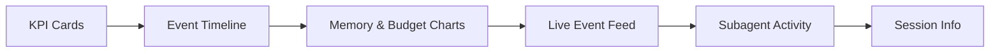
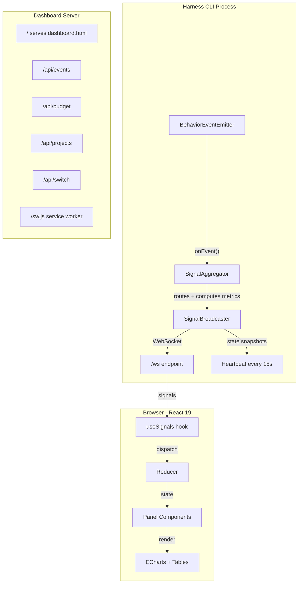
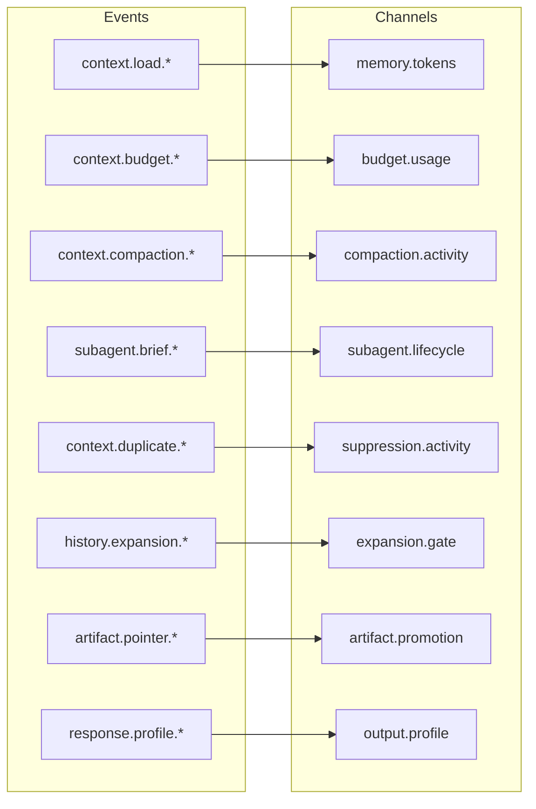

# Real-Time Dashboard

The Harness Forge dashboard is a live window into what your AI agent harness is doing — memory management, budget tracking, compaction decisions, and more. It runs in your browser and updates in real time.

> [!TIP]
> **Quickest way to try it:** Run `hforge dashboard` from any project that has `.hforge/` installed.

---

## Getting Started

### 1. Start the dashboard

```bash
# From any project with Harness Forge installed
hforge dashboard
```

This starts a local server and opens your browser automatically.

```bash
# Use a specific port
hforge dashboard --port 4585
```

### 2. Pick a project

When the dashboard opens, you'll see a **project selector screen**:

- **Paste a path** to any project folder that has `.hforge/` in it
- **Click a project** to open its dashboard
- Your project list is saved in your browser (localStorage) — it survives page refreshes but clears if you clear browser data

> [!NOTE]
> The dashboard is **read-only**. It watches what the harness does but never changes anything.

### 3. What you'll see



| Section | What it shows |
|---------|--------------|
| **KPI Cards** | Total events, memory tokens, budget %, compaction level, enforcement state |
| **Event Timeline** | Every event plotted on a scrollable timeline, color-coded by category |
| **Memory Pressure** | Token usage over time with threshold lines (70%, 80%, 88%, 93%, 96%) |
| **Compaction History** | Tokens before/after each compaction |
| **Budget Breakdown** | How the token budget is split (hot path, output, tools, safety margin) |
| **Live Event Feed** | Scrollable, searchable table of all events — click to expand full JSON |
| **Subagent Briefs** | Recent subagent task briefs with objectives and token estimates |
| **Suppression Gauge** | How many duplicate context sources were removed |
| **Expansion Gate** | History expansion requests: granted vs denied |
| **Session Info** | Session ID, uptime, harness version |

### 4. Switch projects

Click the **project name badge** in the dashboard header to open a dropdown. You can:
- Switch to another project instantly
- Click "Manage Projects..." to go back to the full project selector

---

## How It Works Under the Hood



### Signal Types

The dashboard receives three kinds of signals over WebSocket:

| Type | What it carries | Example |
|------|----------------|---------|
| **event** | A raw behavior event that just happened | Compaction completed, budget warning fired |
| **metric** | A computed number derived from events | Budget usage %, event rate, suppression ratio |
| **state** | A snapshot of current harness state | Enforcement level, compaction level, memory tokens |

> [!IMPORTANT]
> The dashboard **never guesses** the enforcement or compaction level. The server computes the authoritative state and pushes it in every heartbeat (every 15 seconds). This is a deterministic design — the dashboard renders what the server tells it.

### Desktop Notifications

The dashboard registers a **service worker** that can show OS-level notifications when critical events happen, even if the dashboard tab is in the background:

- Budget exceeded
- Memory rotation started
- Compaction triggered
- Subagent brief rejected
- History expansion denied

Your browser will ask for notification permission the first time.

---

## Behavior Events Reference

These are all 23 events the harness can emit. Every event flows through the signal pipeline to the dashboard.

### Memory & Context Events

| Event | When it fires | What it means |
|-------|--------------|---------------|
| `context.load.started` | Session begins loading context | The harness is reading memory, summaries, and active context files |
| `context.load.completed` | Context is fully loaded | All context files have been read and parsed |
| `context.compaction.triggered` | Token budget threshold crossed | The harness decided context needs to be compressed |
| `context.compaction.completed` | Compaction finished | Context was compressed — payload includes tokens before/after |
| `context.summary.promoted` | Session summary was updated | A new checkpoint of the session state was saved |
| `context.delta.emitted` | Delta summary created | Only the changes since last checkpoint were recorded |
| `memory.rotation.started` | Memory file is being rotated | The memory.md file exceeded its hard cap and is being archived |
| `memory.rotation.completed` | Rotation finished | Old memory was archived, new memory.md was written |

### Budget & Policy Events

| Event | When it fires | What it means |
|-------|--------------|---------------|
| `context.budget.warning` | Memory approaches budget limit | Token usage crossed a warning threshold (70-88%) |
| `context.budget.exceeded` | Memory exceeds hard cap | Token usage crossed the critical threshold — action required |
| `history.expansion.requested` | Something wants full history | A component asked to load the complete conversation history |
| `history.expansion.denied` | Expansion was blocked | The request was denied by policy (default: deny unless explicitly allowed) |
| `context.duplicate.suppressed` | Duplicate content removed | The deduplication system found and removed redundant context sources |

### Subagent Events

| Event | When it fires | What it means |
|-------|--------------|---------------|
| `subagent.brief.generated` | A subagent task brief was created | The harness prepared a focused context package for a subagent |
| `subagent.brief.rewritten` | Brief was modified after creation | The brief was adjusted (e.g., too large, missing context) |
| `subagent.brief.rejected` | Brief was rejected | The brief failed validation and was not sent |
| `subagent.run.started` | Subagent execution began | A subagent started working on its task |
| `subagent.run.completed` | Subagent finished | The subagent returned its result |

### Artifact & Output Events

| Event | When it fires | What it means |
|-------|--------------|---------------|
| `artifact.pointer.promoted` | Large content replaced with reference | Inline content over 2000 chars was replaced with a `[See file]` pointer to save tokens |
| `runtime.startup.files.generated` | Startup files were created | The harness generated its initial runtime files (memory.md, budgets, policies) |
| `response.profile.selected` | Output verbosity was chosen | The harness selected brief/standard/deep output mode |
| `response.profile.overridden` | Output verbosity was overridden | Someone explicitly changed the output profile from the default |

---

## Signal Channels

Events are grouped into **channels** that dashboard panels subscribe to:



| Channel | Category | What feeds it | Dashboard panel |
|---------|----------|--------------|-----------------|
| `memory.tokens` | memory | Load and rotation events | Memory Pressure chart, KPI card |
| `memory.rotation` | memory | Rotation start/complete | Compaction History |
| `budget.usage` | budget | Budget warning/exceeded | Budget Gauge |
| `budget.state` | budget | Budget warning/exceeded | Enforcement indicator |
| `compaction.activity` | compaction | Compaction triggered/completed | Compaction History |
| `compaction.stats` | compaction | Compaction completed payloads | Tokens before/after chart |
| `subagent.lifecycle` | subagent | All brief and run events | Subagent cards, Brief Metrics |
| `suppression.activity` | suppression | Duplicate suppressed | Suppression Gauge |
| `expansion.gate` | expansion | Expansion requested/denied | Expansion Gate counters |
| `artifact.promotion` | artifact | Pointer promoted | Tokens Saved counter |
| `output.profile` | output | Profile selected/overridden | Profile Distribution chart |
| `context.lifecycle` | memory | Summary promoted, delta emitted, startup | Event Timeline |
| `events.all` | system | Every event (catch-all) | Live Event Feed |

---

## Testing the Dashboard

### Quick Test (no real events needed)

The dashboard works even with zero events — you'll see empty charts and "Waiting for events..." in the feed. This is useful to verify the server, WebSocket connection, and UI rendering work.

```bash
# Start from any project with .hforge/
hforge dashboard
```

<details>
<summary><strong>What to check</strong></summary>

1. Browser opens automatically
2. Project selector shows (or auto-selects if only one project)
3. Dashboard loads with dark theme
4. Connection indicator shows green "Connected"
5. KPI cards show zeros
6. All chart panels render (no blank spaces or errors)
7. Open browser console (F12) — no errors

</details>

### Test with Simulated Events

Create a test events file to see the dashboard in action:

```bash
# Create a sample events file
mkdir -p .hforge/observability
cat > .hforge/observability/events.json << 'EOF'
[
  {
    "eventId": "bevt_test001",
    "eventType": "context.load.completed",
    "occurredAt": "2026-04-05T10:00:00.000Z",
    "schemaVersion": "1.0.0",
    "runtimeSessionId": "sess_demo",
    "payload": {}
  },
  {
    "eventId": "bevt_test002",
    "eventType": "context.budget.warning",
    "occurredAt": "2026-04-05T10:01:00.000Z",
    "schemaVersion": "1.0.0",
    "runtimeSessionId": "sess_demo",
    "payload": {
      "budgetState": { "estimatedTokens": 3200, "hardCap": 4000 }
    }
  },
  {
    "eventId": "bevt_test003",
    "eventType": "context.compaction.completed",
    "occurredAt": "2026-04-05T10:02:00.000Z",
    "schemaVersion": "1.0.0",
    "runtimeSessionId": "sess_demo",
    "payload": {
      "tokensBeforeAfter": { "before": 3200, "after": 1800 }
    }
  },
  {
    "eventId": "bevt_test004",
    "eventType": "subagent.brief.generated",
    "occurredAt": "2026-04-05T10:03:00.000Z",
    "schemaVersion": "1.0.0",
    "runtimeSessionId": "sess_demo",
    "payload": {
      "objective": "Review authentication module",
      "estimatedTokens": 450,
      "responseProfile": "brief",
      "sourceStateType": "compacted"
    }
  },
  {
    "eventId": "bevt_test005",
    "eventType": "context.duplicate.suppressed",
    "occurredAt": "2026-04-05T10:04:00.000Z",
    "schemaVersion": "1.0.0",
    "runtimeSessionId": "sess_demo",
    "payload": {
      "suppressionCounts": { "total": 8, "suppressed": 3 }
    }
  }
]
EOF

# Now start the dashboard — it will load these events on connect
hforge dashboard
```

You should see:
- 5 events in the Live Event Feed
- Budget gauge showing 80% (3200/4000)
- Compaction history bar showing 3200 → 1800
- Subagent brief card with "Review authentication module"
- Suppression gauge showing 37.5% (3/8)

### Test WebSocket Reconnection

1. Start the dashboard
2. Stop the server (Ctrl+C)
3. Watch the connection indicator turn to "Reconnecting..."
4. Restart the server
5. Connection should recover automatically within 30 seconds

### Test Project Switching

1. Start the dashboard
2. Add two different project paths
3. Click one to open its dashboard
4. Click the project name in the header → dropdown
5. Click the other project
6. Dashboard should reset and show the new project's data

---

## Troubleshooting

<details>
<summary><strong>Dashboard shows "Disconnected" and won't reconnect</strong></summary>

The dashboard server might have crashed. Check the terminal where you ran `hforge dashboard` for errors. Restart with:

```bash
hforge dashboard
```

</details>

<details>
<summary><strong>Charts are empty even though events exist</strong></summary>

Check that `.hforge/observability/events.json` exists and contains valid JSON. The dashboard reads this file on connect.

```bash
cat .hforge/observability/events.json | head -5
```

</details>

<details>
<summary><strong>Port is already in use</strong></summary>

Another process is using the port. Either stop that process or use a different port:

```bash
hforge dashboard --port 4590
```

</details>

<details>
<summary><strong>Browser doesn't open automatically</strong></summary>

Open it manually. The terminal output shows the URL:

```
Harness dashboard running at http://127.0.0.1:4583
```

</details>

<details>
<summary><strong>Notifications not working</strong></summary>

1. Check that your browser allows notifications from localhost
2. Look for the notification permission prompt — you may need to click "Allow"
3. Notifications only fire for **live** events, not historical replays

</details>
