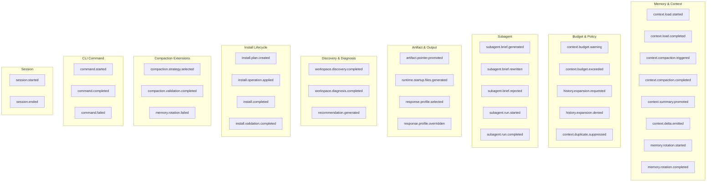

# Event Taxonomy

Every decision the harness makes is recorded as a **behavior event**. These events are:

- **Typed** — each has a specific name and structured payload
- **Append-only** — written to `.hforge/observability/events.json`
- **Local** — nothing is sent to any external service
- **Streamable** — the [dashboard](../dashboard.md) shows them in real time

> [!TIP]
> Run `hforge dashboard` to see events as they happen. Or read the JSON file directly:
> ```bash
> cat .hforge/observability/events.json | python -m json.tool
> ```

---

## Event Categories



---

## All Events (37 total)

### Memory & Context (8 events)

These events track how the harness loads, compresses, and rotates context.

| Event | Meaning | Key Payload Fields |
|-------|---------|-------------------|
| `context.load.started` | Context loading began | `workspaceRoot` |
| `context.load.completed` | Context fully loaded | `sourcesLoaded`, `durationMs`, `loadOrder` |
| `context.compaction.triggered` | Compaction was decided | `level`, `estimatedEvents` |
| `context.compaction.completed` | Compaction finished | `tokensBeforeAfter.before`, `tokensBeforeAfter.after`, `durationMs` |
| `context.summary.promoted` | Session summary saved | `summaryId`, `coveredEventRange` |
| `context.delta.emitted` | Delta (changes-only) saved | `deltaId`, `sinceSummaryId` |
| `memory.rotation.started` | memory.md is being archived | `tokensBefore`, `memoryPath` |
| `memory.rotation.completed` | New memory.md written | `automatic`, `tokensBefore`, `tokensAfter`, `durationMs` |

### Budget & Policy (5 events)

These events track token budget pressure and access control decisions.

| Event | Meaning | Key Payload Fields |
|-------|---------|-------------------|
| `context.budget.warning` | Approaching budget limit | `budgetState.estimatedTokens`, `budgetState.hardCap`, `enforcementLevel`, `suggestedAction` |
| `context.budget.exceeded` | Over the hard cap | `budgetState.estimatedTokens`, `budgetState.hardCap`, `enforcementLevel` |
| `history.expansion.requested` | Full history was requested | `reason`, `overrideFlag` |
| `history.expansion.denied` | Request was blocked by policy | `reason`, `requestedReason` |
| `context.duplicate.suppressed` | Redundant sources removed | `suppressionCounts.total`, `suppressionCounts.suppressed`, `suppressedSources` |

### Subagent (5 events)

These events track the lifecycle of subagent task briefs.

| Event | Meaning | Key Payload Fields |
|-------|---------|-------------------|
| `subagent.brief.generated` | Brief was created | `objective`, `estimatedTokens`, `responseProfile`, `decisionsIncluded` |
| `subagent.brief.rewritten` | Brief was modified | `truncatedDecisions`, `tokensBefore`, `tokensAfter` |
| `subagent.brief.rejected` | Brief failed validation | `reason`, `violationCount` or `estimatedTokens`, `maxTokens` |
| `subagent.run.started` | Subagent started working | — |
| `subagent.run.completed` | Subagent finished | — |

### Artifact & Output (4 events)

These events track token-saving promotions and output verbosity decisions.

| Event | Meaning | Key Payload Fields |
|-------|---------|-------------------|
| `artifact.pointer.promoted` | Large content replaced with pointer | `artifactId`, `sourcePath`, `estimatedTokensSaved` |
| `runtime.startup.files.generated` | Initial files created | `filesGenerated`, `paths`, `durationMs` |
| `response.profile.selected` | Output mode chosen | `profile`, `source`, `context` |
| `response.profile.overridden` | Output mode explicitly changed | `profile`, `context`, `reason` |

### Discovery & Diagnosis (3 events)

These events track workspace scanning, target detection, and recommendation generation.

| Event | Meaning | Key Payload Fields |
|-------|---------|-------------------|
| `workspace.discovery.completed` | Workspace targets detected | `targetsFound`, `confidence`, `evidence`, `detectedCount` |
| `workspace.diagnosis.completed` | Repo diagnosis finished | `languages`, `frameworks`, `repoType`, `durationMs` |
| `recommendation.generated` | Bundles/profiles recommended | `bundles`, `profiles`, `source`, `durationMs` |

### Install Lifecycle (4 events)

These events track the full install pipeline from planning through per-file operations to completion.

| Event | Meaning | Key Payload Fields |
|-------|---------|-------------------|
| `install.plan.created` | Install plan computed | `operationCount`, `targetId`, `profileId`, `planHash` |
| `install.operation.applied` | Single file operation applied | `operation` (copy/merge/append/skip), `bundleId`, `target`, `durationMs` |
| `install.completed` | Full install finished | `totalOperations`, `filesWritten`, `targetId`, `durationMs` |
| `install.validation.completed` | Environment validated | `valid`, `warnings`, `errors` |

### Compaction Extensions (3 events)

These events provide deeper visibility into compaction strategy decisions and failures.

| Event | Meaning | Key Payload Fields |
|-------|---------|-------------------|
| `compaction.strategy.selected` | Compaction strategy chosen | `strategy`, `reason`, `triggerType`, `eventsToProcess` |
| `compaction.validation.completed` | Compaction safety validated | `valid`, `criticalEventsPreserved`, `tokenReduction`, `violations` |
| `memory.rotation.failed` | Memory rotation failed | `reason`, `phase`, `recoverable` |

### CLI Command Lifecycle (3 events)

These events provide full visibility into every CLI command invocation, outcome, and timing.

| Event | Meaning | Key Payload Fields |
|-------|---------|-------------------|
| `command.started` | CLI command invoked | `command`, `args`, `workspaceRoot` |
| `command.completed` | CLI command succeeded | `command`, `exitCode`, `durationMs` |
| `command.failed` | CLI command failed | `command`, `error`, `exitCode`, `durationMs`, `recoverable` |

### Session Lifecycle (2 events)

These events mark the start and end of a harness-forge CLI session.

| Event | Meaning | Key Payload Fields |
|-------|---------|-------------------|
| `session.started` | Session began | `sessionId`, `version`, `workspaceRoot`, `nodeVersion` |
| `session.ended` | Session finished | `sessionId`, `totalDurationMs`, `commandsRun` |

---

## Event Structure

Every event has this shape:

```json
{
  "eventId": "bevt_a1b2c3d4e5f6789012345678",
  "eventType": "context.compaction.completed",
  "occurredAt": "2026-04-05T10:02:00.000Z",
  "schemaVersion": "1.0.0",
  "runtimeSessionId": "sess_abc123",
  "taskId": "optional-task-id",
  "correlationId": "optional-correlation-id",
  "payload": {
    "tokensBeforeAfter": { "before": 3200, "after": 1800 }
  }
}
```

| Field | Always present | Description |
|-------|---------------|-------------|
| `eventId` | Yes | Unique ID starting with `bevt_` |
| `eventType` | Yes | One of the 37 event type strings |
| `occurredAt` | Yes | ISO 8601 timestamp |
| `schemaVersion` | Yes | Always `"1.0.0"` for now |
| `runtimeSessionId` | Yes | Session that produced the event |
| `taskId` | No | If the event is tied to a specific task |
| `correlationId` | No | Links related events together |
| `payload` | Yes | Event-specific data (can be empty `{}`) |

---

## Where Events Are Stored

```
.hforge/
└── observability/
    ├── events.json          ← All behavior events (append-only)
    └── summary.json         ← Aggregated effectiveness signals
```

The dashboard reads `events.json` on connect and streams new events via WebSocket.

---

## Budget Thresholds

The enforcement ladder uses these thresholds to decide when to compress context:

| % of Budget Used | State | What Happens |
|-----------------|-------|-------------|
| < 70% | **Guidance** | Everything is fine, no action |
| 70% | **Evaluate** | Start monitoring, informational |
| 80% | **Trim** | Remove low-importance items |
| 88% | **Summarize** | Compress medium-importance items |
| 93% | **Rollup** | Aggressive compression |
| 96% | **Rollover** | Maximum compression, archive old context |

These thresholds are configured in `.hforge/runtime/context-budget.json` and sent to the dashboard automatically — the dashboard never hardcodes them.
